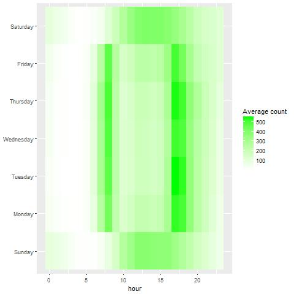

Bike Sharing 

Bike sharing systems are a means of renting bicycles where the process of obtaining membership, rental, and bike return is
automated via a network of kiosk locations throughout a city. Using these systems, people are able rent a bike from a one
location and return it to a different place on an as-needed basis. Currently, there are over 500 bike-sharing programs around
the world.

The data generated by these systems makes them attractive for researchers because the duration of travel, departure location,
arrival location, and time elapsed is explicitly recorded. Bike sharing systems therefore function as a sensor network, which
can be used for studying mobility in a city. In this competition, participants are asked to combine historical usage patterns
with weather data in order to forecast bike rental demand in the Capital Bikeshare program in Washington, D.C.

In this competition the data provided is hourly rental data spanning two years. For this competition, the training set
is comprised of the first 19 days of each month, while the test set is the 20th to the end of the month. We have to 
predict the total count of bikes rented during each hour covered by the test set, using only information available prior
to the rental period. It is a typical time-series problem

Data 
    datetime - hourly date + timestamp  
    season -  1 = spring, 2 = summer, 3 = fall, 4 = winter 
    holiday - whether the day is considered a holiday
    workingday - whether the day is neither a weekend nor holiday
    weather - 1: Clear, Few clouds, Partly cloudy, Partly cloudy 
              2: Mist + Cloudy, Mist + Broken clouds, Mist + Few clouds, Mist 
              3: Light Snow, Light Rain + Thunderstorm + Scattered clouds, Light Rain + Scattered clouds 
              4: Heavy Rain + Ice Pallets + Thunderstorm + Mist, Snow + Fog 
    temp - temperature in Celsius
    atemp - "feels like" temperature in Celsius
    humidity - relative humidity
    windspeed - wind speed
    casual - number of non-registered user rentals initiated
    registered - number of registered user rentals initiated
    count - number of total rentals

The most information containing variable is datetime and the weekday, month, date, hour is scraped from the single varvariation

Looking into during different season

Visualisng the number of rented cycles change in every hour of a week.

  
 

 

Visualisng the number of rented cycles variation in every hour during different weather

Visualising the count variable 

The count data is skewed
count is converted into log(count+1) to balance skewness.

Random forest looks the better algoritm right now considering the accuracy parameter as RMSLE.
Applying randomforest on the independent variables as hour, month, year, weekday, windspeed, atemp,humidity, weather, season, holiday, workingday.

Variable importance plot

RMSLE 0.47 on Leaderboard using simple model.

Dive Deep in Data! :)

